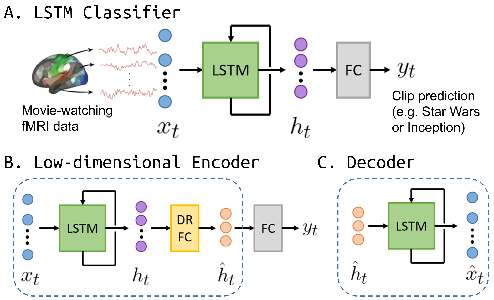
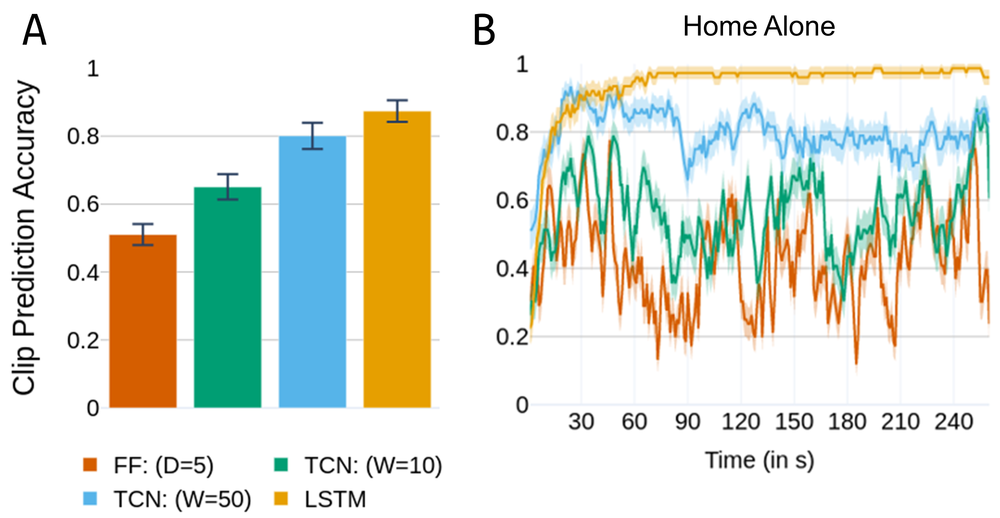
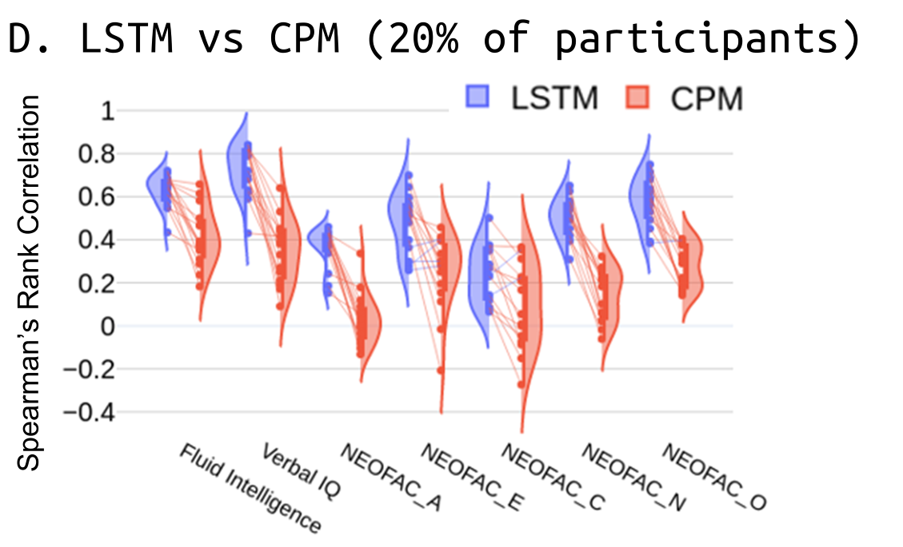

# Capturing brain dynamics: latent spatiotemporal patterns predict stimuli and individual differences 

This repository is the official implementation of [Capturing brain dynamics: latent spatiotemporal patterns predict stimuli and individual differences](https://www.biorxiv.org/content/10.1101/2020.06.11.146969v1). 



(A) The classifier consisted of Long Short-Term Memory (LSTM) units with a fully-connected (FC) dense layer for label prediction at each time step.

(B) For dimensionality reduction, the LSTM outputs were first linearly projected to a lower dimensional space using a fully-connected layer (DR-FC). Classification was then performed on the low-dimensional representations.

(C) LSTM decoder used to reconstruct the original time series from the low-dimensional representation.

## Requirements

To install requirements:

```setup
pip install -r requirements.txt
```

> CUDA version: 10.0.130 

Data: We employed Human Connectome Project (HCP) movie-watching data from the [Young Adult study](https://www.humanconnectome.org/study/hcp-young-adult). Access to HCP data requires [registration](https://db.humanconnectome.org) and agreeing to their [Data Use Terms](https://www.humanconnectome.org/study/hcp-young-adult/data-use-terms). The required data is under:
> Session Type: 7T fMRI; Movie Task fMRI 2mm/32k FIX-Denoised (Compact)

To preprocess this data (parcellation, standardization, etc.), run:

```
python preprocess.py --input-data <path_to_data> \
    --output-data data/roi_ts --roi 300 --net 7
```

## Training and Evaluation

To train the clip prediction model in the paper, run this command:

```
python clip_lstm.py --input-data data/roi_ts --roi 300 --net 7 \
    --k_hidden 150 --train_size 100
```

To train competing models (FF: feed-forward, TCN: temporal convolution neural network):
```
python clip_ff.py --input-data data/roi_ts --roi 300 --net 7 \
    --k_hidden 150 --k_layers 5 --train_size 100

python clip_tcn.py --input-data data/roi_ts --roi 300 --net 7 \
    --k_hidden 150 --k_wind 10 --train_size 100
```

Hyperparameters such as number of hidden states (`--k_hidden`), number of feed-forward layers (`--k_layers`), length of temporal window (`--k_wind`) were trained using a 10-fold cross-validation (`--k_fold`). 

To use ROIs from a particular subnetwork (see `data/parcellation`), use the `--subnet` option (e.g. --subnet Default for default-mode network ROIs only).

---

To train the behavior/personality prediction model in the paper:
```
python bhv_lstm.py --input-data <path_to_data> --roi 300 --net 7 \
    --bhv PMAT24_A_CR --k_hidden 150 --cutoff 0.1
```
To compare to Connectome-based Predictive Modeling (CPM), run:
```
python bhv_cpm.py --input-data <path_to_data> --roi 300 --net 7 \
    --bhv PMAT24_A_CR --cutoff 0.1
```

The above require downloading a [behavioral data file](https://db.humanconnectome.org/data/projects/HCP_1200) from HCP and placed in `data/unrestricted_behavioral.csv`.
Options for `--bhv` in the paper are: `['PMAT24_A_CR', 'PicVocab_Unadj',
        'NEOFAC_A', 'NEOFAC_E', 'NEOFAC_C',
        'NEOFAC_N', 'NEOFAC_O']`

We trained our models with a subset of the participants. The selection of high and low scorers was based on the `--cutoff` parameter. `--cutoff 0.1` selects top and bottom 10% of the scorers.

## Results

Comparison of various models for clip prediction:



Results are compared in `clip_compare.ipynb`.

Comparison of LSTMs and CPM for behavior/personality prediction:



Results are compared in `bhv_compare.ipynb`.